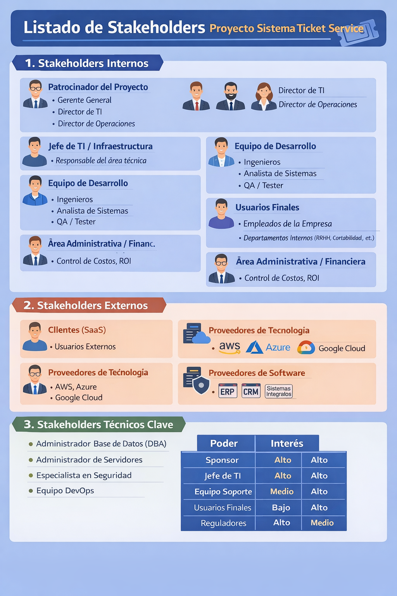
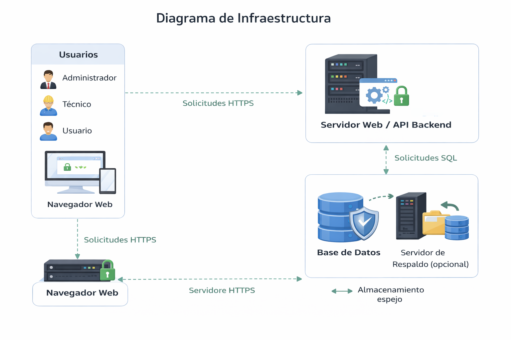
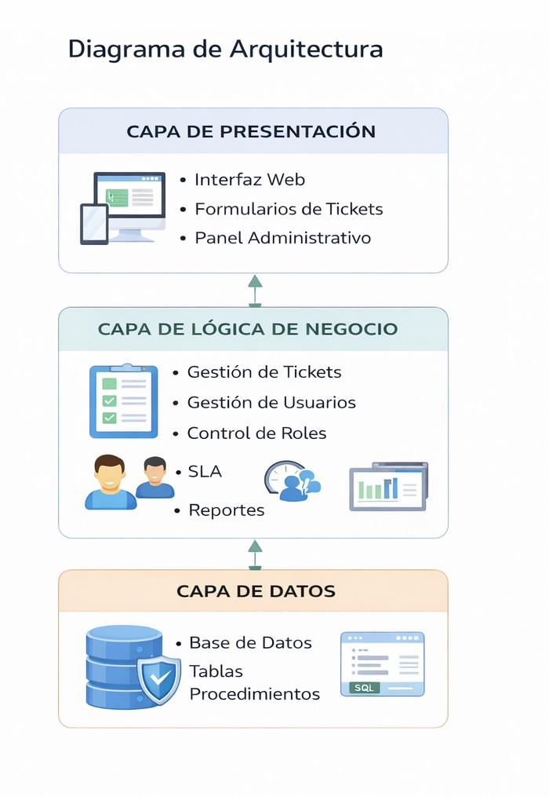
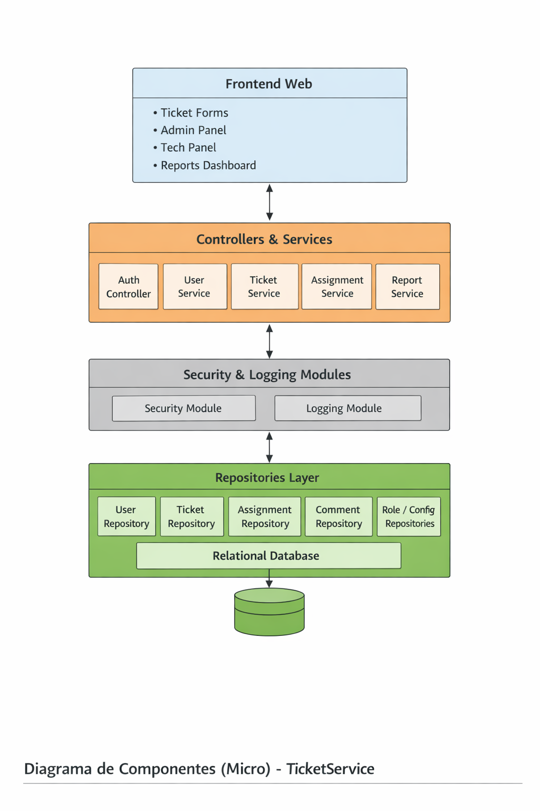
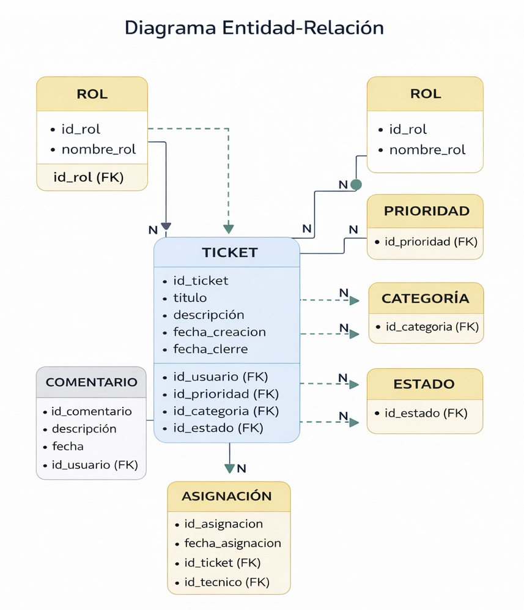

<div align="center">

# UNIVERSIDAD ESPÍRITU SANTO  
**Ciencias de la Computación**  
**Ingeniería de Software I**

<br>

## GRUPO 5  
Christian Leonardo Suarez Rios  
Jose Moises Arias Zavala  

<br>

# DISEÑO DE ARQUITECTURA DE SOFTWARE  
## TicketService  
### Versión 1.1.0  

<br>

Febrero, 2026  
Guayaquil, Ecuador  

</div>

---

# 🕘 Historial de Versionamiento

| Fecha | Versión | Descripción | Responsable |
|--------|----------|-------------|-------------|
| 19/01/26 | 1.0.0 | Creación del documento TicketService | Equipo de Desarrollo |
| 28/02/26 | 1.1.0 | Documento completo con trazabilidad y formato IEEE | Equipo de desarrollo |

---

# 📑 Contenido

1. Historial de Versionamiento  
2. Listado de tablas  
3. Listado de gráficos  
4. Introducción  
5. Mapeo del Hardware y Software  
   - 5.1 Diagrama de Infraestructura  
   - 5.2 Diagrama de Arquitectura (Macro)  
   - 5.3 Diagrama de Componentes (Micro)  
   - 5.4 Diagrama de Entidad-Relación  
6. Control de Acceso y Seguridad  
7. Referencias  

---

# Listado de tablas



---

## Listado de gráficos







---


# INTRODUCCIÓN

TicketService es un sistema web diseñado para la creación, gestión y seguimiento de tickets de soporte técnico y órdenes de trabajo dentro de organizaciones educativas y pequeñas empresas.

El sistema permite centralizar las solicitudes de soporte, asignarlas a técnicos responsables, establecer prioridades, controlar tiempos de atención (SLA) y generar reportes de desempeño.

Desde el punto de vista arquitectónico, TicketService está diseñado bajo una arquitectura cliente-servidor en tres capas, garantizando:

- Separación de responsabilidades  
- Escalabilidad  
- Mantenibilidad  
- Seguridad en el manejo de datos  
El objetivo principal del diseño arquitectónico es asegurar que el sistema pueda crecer, ser desplegado tanto en entornos locales como en la nube y soportar múltiples usuarios concurrentes.
---

# Mapeo de Hardware y Software

## Componentes de Hardware

Cliente
- Computadora de escritorio o laptop  
- Navegador web moderno 
- Conexión a Internet o red local

Servidor
- Procesador mínimo 2 núcleos  
- 8GB RAM recomendados 
- Almacenamiento SSD
- ASistema operativo Linux o Windows Server

Base de Datos
- 	Puede estar en el mismo servidor (entorno pequeño)
- 	O servidor dedicado en la nube (AWS, Azure, DigitalOcean)

## Mapeo de Software

Software Cliente
-	Navegador web (Chrome, Edge, Firefox)
-	HTML5
-	CSS3
-	JavaScript

Backend
-	Node.js / Java / Python (según implementación)
-	Framework (Express / Spring Boot / Django)

Base de Datos
-	MySQL o PostgreSQL

Servidor Web
-	Nginx o Apache

Control de Versiones
-	Git (Repositorio en GitHub)

---
El sistema TicketService se implementa bajo un modelo cliente-servidor. 
El cliente utiliza navegadores web modernos en computadoras con conexión a internet o red local.          

El servidor requiere mínimo un procesador de 2 núcleos, 8GB de RAM y almacenamiento SSD, ejecutando Linux o Windows Server. 

El backend puede desarrollarse en Node.js, Java o Python, utilizando frameworks como Express, Spring Boot o Django. 

La base de datos recomendada es MySQL o PostgreSQL, y el servidor web puede utilizar Nginx o Apache.


# Diagrama de Infraestructura

## Descripción del Diagrama

La infraestructura de TicketService se basa en un modelo cliente-servidor.
### Componentes:
1.	Usuarios (Administrador, Técnico, Usuario)
2.	Navegador Web
3.	Servidor Web / Aplicación
4.	Base de Datos
5.	Servidor de Respaldo (opcional)

### Representación textual del Diagrama de Infraestructura
```mermaid
[Usuarios]
     |
     v
[Navegador Web]
     |
     v
[Servidor Web / API Backend]
     |
     v
[Base de Datos]
```
### Descripción Técnica
-	Los usuarios acceden mediante navegador.
-	El navegador envía solicitudes HTTP/HTTPS.
-	El servidor procesa la lógica de negocio.
-	La base de datos almacena la información persistente.
-	El acceso se realiza mediante conexión segura SSL/TLS.

---
La infraestructura se basa en un modelo cliente-servidor. 
Los usuarios acceden al sistema mediante un navegador web que se comunica vía HTTP/HTTPS con el servidor de aplicación. 

El servidor procesa la lógica de negocio y se conecta a la base de datos para almacenamiento persistente.
 
Se recomienda el uso de SSL/TLS para garantizar la seguridad en la transmisión de datos.

---
# Diagrama de Arquitectura
Se adopta una arquitectura en tres capas: presentación, lógica de negocio y datos. 

-	La capa de presentación incluye la interfaz web y formularios.
-	La capa de lógica gestiona tickets, usuarios, roles, SLA y reportes.
-	La capa de datos administra la base de datos relacional. 
-	Esta arquitectura permite escalabilidad, mantenibilidad y separación clara de responsabilidades.
### Tipo de Arquitectura
Arquitectura en 3 Capas (Three-Tier Architecture)
1.	Capa de Presentación
2.	Capa de Lógica de Negocio
3.	Capa de Datos

### Representación del Diagrama de Arquitectura
```mermaid
CAPA DE PRESENTACIÓN
- Interfaz Web
- Formularios de Tickets
- Panel Administrativo

     |
     v
CAPA DE LÓGICA DE NEGOCIO
- Gestión de Tickets
- Gestión de Usuarios
- Control de Roles
- SLA
- Reportes

     |
     v
CAPA DE DATOS
- Base de Datos
- Tablas
- Procedimientos
```

### Justificación Arquitectónica
Se eligió arquitectura en 3 capas porque:
-	Permite separar responsabilidades
-	Facilita mantenimiento
-	Permite escalabilidad futura
-	Es adecuada para aplicaciones web académicas y empresariales        pequeñas


### Conclusión de la selección
El diseño arquitectónico de TicketService demuestra:
-	Separación clara de responsabilidades
-	Modelo de infraestructura escalable
-	Base de datos estructurada y normalizada
-	Diseño adecuado para implementación web
La arquitectura propuesta garantiza mantenibilidad, seguridad y crecimiento      futuro del sistema.


# Diagrama de Componentes (Micro)

### Descripción

El Diagrama de Componentes (micro) detalla la estructura interna de la capa de lógica de negocio del sistema TicketService, mostrando los módulos que         implementan la gestión de usuarios, tickets, asignaciones y seguridad, así como su relación con la base de datos.
Este nivel complementa el diagrama macro (3 capas) previamente definido.


## Componentes Identificados
### 1. Capa de Presentación
#### Frontend Web
-	Formularios de tickets
-	Panel administrador
-	Panel técnico
-	Dashboard de reportes
-	Comunicación vía HTTP/HTTPS

### 2. Capa de Lógica de Negocio
#### AuthController
-	Autenticación
-	Validación de credenciales
-	Gestión de sesiones
#### UserService
-	Gestión de usuarios y roles
#### TicketService
-	Crear, editar y cerrar tickets
-	Control de estado, prioridad y categoría
-	Gestión de SLA

 #### AssignmentService
-	Asignación de tickets a técnicos
 #### CommentService
-	Registro de comentarios
 #### ReportService
-	Métricas y reportes (estado, SLA, desempeño)

#### SecurityModule (Transversal)
-	Control de acceso basado en roles (RBAC)
-	Validación de permisos
-	Protección de rutas

### 3. Capa de Datos
Repositorios (acceso a base de datos relacional):
-	UserRepository
-	TicketRepository
-	AssignmentRepository
-	CommentRepository
-	RoleRepository
-	CategoriaRepository
-	PrioridadRepository
-	EstadoRepository
Garantizan integridad referencial y persistencia de datos.
## Representación Simplificada
```mermaid
[Frontend Web]
     |
     v
[Controllers / Services]
     |
     v
[Security Module]
     |
     v
[Repositories]
     |
     v
[Base de Datos]
```
### Justificación
El diseño micro respeta la arquitectura en 3 capas definida en el documento:
-	Separación de responsabilidades
-	Escalabilidad
-	Mantenibilidad
-	Seguridad mediante RBAC
Permite que cada módulo cumpla una función específica dentro del sistema   TicketService sin afectar otros componentes.


---

# Diagrama Entidad-Relación

#### Usuario
-	id_usuario (PK)
-	nombre
-	correo
-	contraseña
-	id_rol (FK)
#### Rol
-	id_rol (PK)
-	nombre_rol
#### Relación:
Un rol puede tener muchos usuarios.

#### Ticket
-	id_ticket (PK)
-	titulo
-	descripcion
-	fecha_creacion
-	fecha_cierre
-	id_usuario (FK)
-	id_prioridad (FK)
-	id_categoria (FK)
-	id_estado (FK)
#### Relaciones:
-	Un usuario crea muchos tickets.
-	Un ticket pertenece a una categoría.
-	Un ticket tiene una prioridad.
-	Un ticket tiene un estado.
 
#### Comentario
-	id_comentario (PK)
-	descripcion
-	fecha
-	id_ticket (FK)
-	id_usuario (FK)
#### Relación:
Un ticket puede tener muchos comentarios.
 
#### Asignación
-	id_asignacion (PK)
-	id_ticket (FK)
-	id_tecnico (FK)
-	fecha_asignacion
#### Relación:
Un técnico puede tener múltiples tickets asignados.


---

### Representación Simplificada del ER
ROL 1 ----- N USUARIO

USUARIO 1 ----- N TICKET

TICKET 1 ----- N COMENTARIO

TICKET N ----- 1 PRIORIDAD

TICKET N ----- 1 CATEGORIA

TICKET N ----- 1 ESTADO

TICKET 1 ----- N ASIGNACION

---
El modelo entidad-relación incluye las entidades Usuario, Rol, Ticket, Categoría, Prioridad, Estado, Comentario y Asignación. 
Un rol puede tener múltiples usuarios. 
Un usuario puede crear múltiples tickets.
Un ticket puede tener múltiples comentarios y asignaciones. 
Cada ticket se asocia con una categoría, prioridad y estado. 
El modelo se encuentra normalizado para evitar redundancia y garantizar integridad referencial.


## Control de Acceso y Seguridad 
### Descripción General
El sistema TicketService implementa un modelo de control de acceso basado en roles (RBAC – Role Based Access Control), garantizando que cada usuario acceda únicamente a las funcionalidades autorizadas según su perfil.
Además, se aplican mecanismos de seguridad para proteger:
-	Confidencialidad de la información
-	Integridad de los datos
-	Disponibilidad del sistema
-	Autenticación y autorización de usuarios

### Actores / Descripción / Tareas
| Actor | Descripción | Tareas / Permisos | 
|--------|----------|-------------|
| Administrador | Usuario con control total del sistema. Responsable de la configuración general y supervisión. | - Crear, editar y eliminar usuarios - Asignar roles - Configurar categorías y prioridades - Visualizar todos los tickets - Generar reportes globales - Cerrar o reabrir tickets
 |
| Técnico | Usuario encargado de resolver tickets asignados. | - Visualizar tickets asignados - Cambiar estado del ticket - Agregar comentarios técnicos - Registrar fecha de solución - Actualizar progreso del ticket|
 | Usuario (Cliente Interno) | Persona que genera solicitudes de soporte. | - Crear nuevos tickets - Adjuntar información descriptiva - Consultar estado de sus tickets - Agregar comentarios adicionales - Cerrar ticket (si está resuelto)|


### Mecanismos de Seguridad Implementados
#### Autenticación
-	Inicio de sesión con correo electrónico y contraseña.
-	Contraseñas almacenadas en formato cifrado (hash seguro).
-	Validación de credenciales en el servidor.
#### Autorización
-	Validación de permisos según rol.
-	Restricción de acceso a rutas y funcionalidades.
-	Separación clara entre funciones administrativas y operativas.
#### Seguridad en la Comunicación
-	Uso de protocolo HTTPS.
-	Certificado SSL/TLS.
-	Protección contra ataques Man-in-the-Middle.
#### Seguridad de Datos
-	Integridad referencial en base de datos.
-	Restricciones de claves foráneas.
-	Validación de datos de entrada (prevención de SQL Injection).
-	Control de sesiones activas.
#### Respaldo y Recuperación
-	Copias de seguridad periódicas.
-	Servidor de respaldo opcional.
-	Posibilidad de restauración ante fallos.
#### Principios de Seguridad Aplicados
-	Principio de mínimo privilegio
-	Separación de responsabilidades
-	Confidencialidad, Integridad y Disponibilidad (Triada CIA)
-	Trazabilidad de acciones mediante registros (logs)
#### Conclusión de Seguridad
El modelo de control de acceso de TicketService garantiza que cada actor           interactúe con el sistema dentro de límites definidos, reduciendo riesgos de        acceso no autorizado, pérdida de información o manipulación indebida de datos.
La implementación de autenticación segura, autorización por roles y                      comunicación cifrada fortalece la confiabilidad del sistema y lo hace apto para entornos académicos y empresariales.


## XI. REFERENCIAS

[1] Pressman, R. (2014). Ingeniería de software: Un enfoque práctico. McGraw-Hill.  
[2] Sommerville, I. (2016). Software engineering. Pearson Education.  
[3] IEEE Computer Society. (2014). Guide to the Software Engineering Body of Knowledge (SWEBOK).