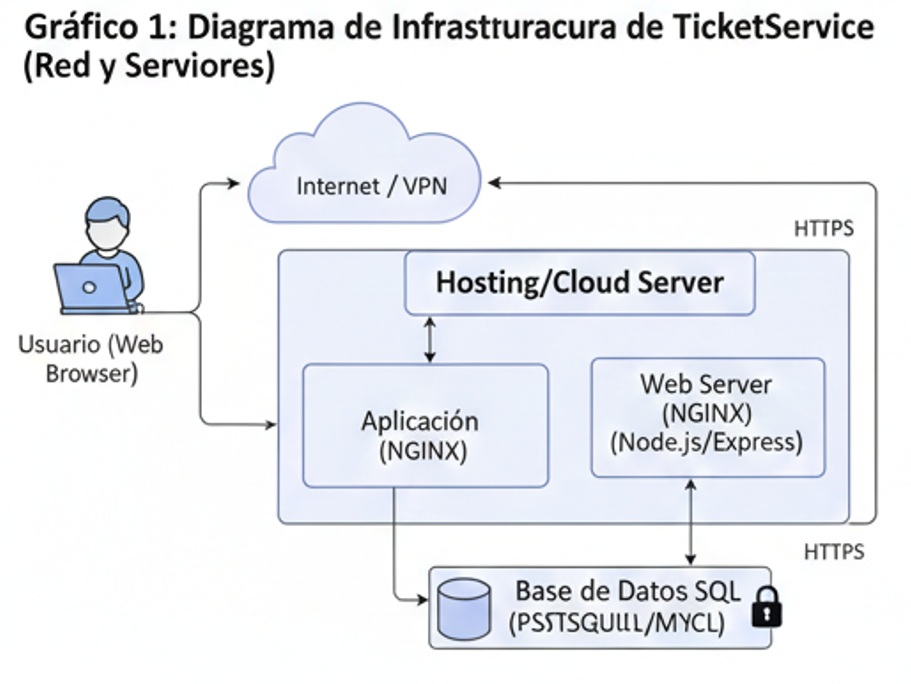
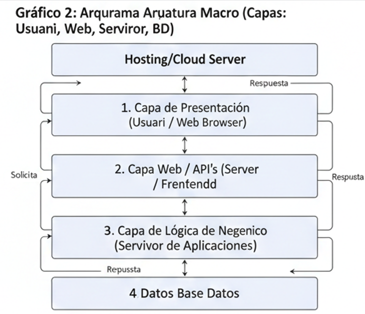
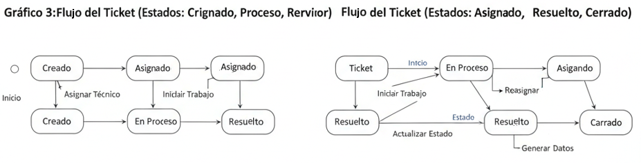
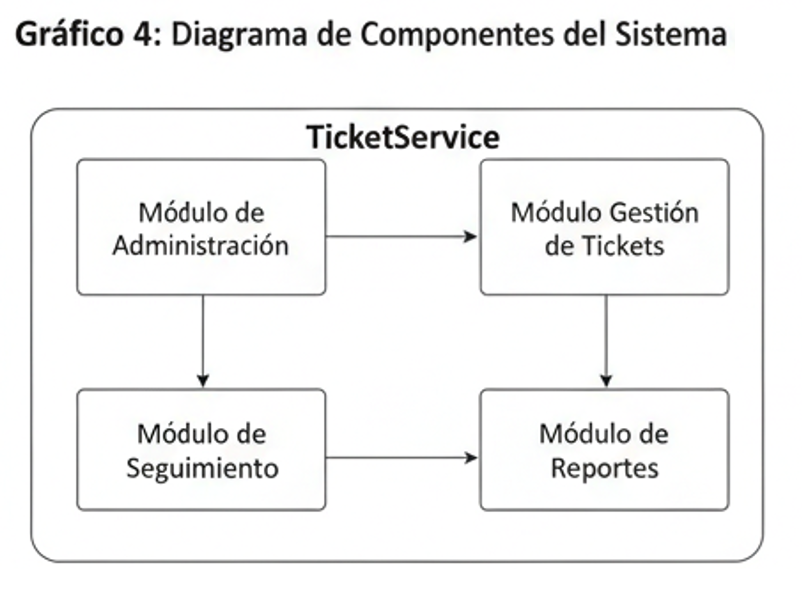
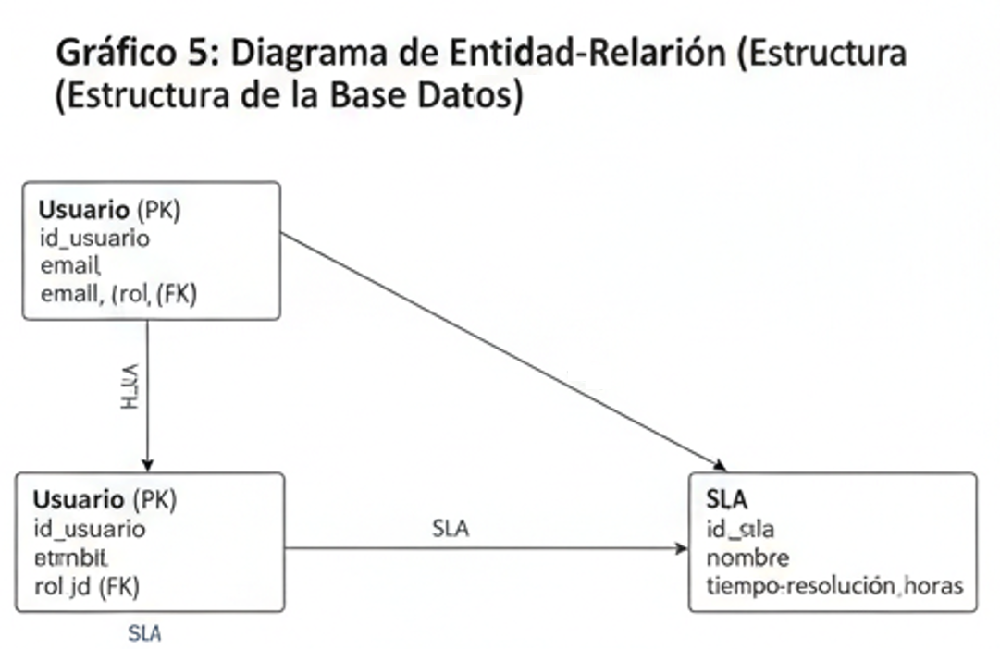
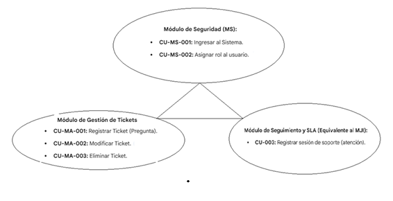

# UNIVERSIDAD ESPÍRITU SANTO  
**Ciencias de la Computación**  
**Ingeniería de Software I**

 

## GRUPO 5  
Christian Leonardo Suarez Rios  
Jose Moises Arias Zavala  

 

# DISEÑO DE ARQUITECTURA DE SOFTWARE  
## TicketService  
## Diseño Detallado de Software
### Versión 1.1.0  

 

Febrero, 2026  
Samborondon, Ecuador  

---

# 🕘 Historial de Versionamiento

| Fecha | Versión | Descripción | Responsable |
|--------|----------|-------------|-------------|
| 28/02/26 | 1.0.0 | Creación del documento TicketService | Equipo de Desarrollo |

##

# 📑 Contenido

- Historial de Versionamiento

- Listado de tablas	

- Listado de gráficos	

- Introducción	

- Diagrama de Clases	

- Diagrama de Componentes	

- Diagrama de Interacción de Objetos	

- Lista de Casos de Uso	

- Descripción de Casos de Uso	

- Módulo de Seguridad (MS)	

- Módulo Académico (MA)	

- Módulo de Juego Interactivo (MJI)

- Lista de Escenarios	

- Descripción de Escenarios	

- Módulo de Seguridad (MS)	

- Diagrama de Casos de Uso	

- Diagrama de Secuencia	

- Módulo de Seguridad (MS)	

- Diagrama de Colaboración	

- Módulo de Seguridad (MS)	

- Diagrama de Actividad	

- Prototipos	

---

# Módulo de Seguridad (MS)	

---

# Listado de tablas

Tabla 1. Listado de los stakeholders

| Cargo | Representa | Rol | Tarea |
|--------|----------|-------------|-------------|
| Administrador | Organizacion | Gestión del sistema | Configura y controla la totalidad del sistema. |
| Usuario | Clientes internos | Registro de tickets | Crea tickets de soporte técnico de manera centralizada. |
| Técnico | Equipo de Soporte | Resolución | Resuelve órdenes de trabajo y actualiza el estado de los tickets. |
| Agente | Soporte Técnico | Atención de tickets  | Encargado de la atención y seguimiento de las solicitudes según el SLA |

---

## Listado de gráficos

---

#  Diagrama de Clases

## Usuario

•	Descripción: Persona que interactúa con el sistema (puede ser cliente interno o administrador).
•	Atributos: idUsuario (Integer), nombre (String), correo (String), contrasena (String).
•	Métodos: iniciarSesion(), cerrarSesion().

## Rol

•	Descripción: Define los permisos en el sistema basándose en los perfiles: Administrador, Usuario y Técnico/Agente.
•	Atributos: idRol (Integer), nombreRol (String), descripcion (String).
•	Métodos: asignarRol().

## Ticket

•	Descripción: La solicitud registrada en el sistema.
•	Atributos: idTicket (Integer), titulo (String), descripcion (Text), categoria (String), prioridad (String) , estado (String) - los estados son: Creado, Asignado, Proceso, Resuelto, Cerrado, fechaCreacion (Date).
•	Métodos: crearTicket(), actualizarEstado(), asignarTecnico(), cerrarTicket().

## Agente (Técnico)

•	Descripción: Persona que atiende y resuelve los tickets. Hereda de Usuario o se relaciona con él.
•	Atributos: idAgente (Integer), especialidad (String).
•	Métodos: resolverTicket().

## SLA (Acuerdo de Nivel de Servicio)

•	Descripción: Las reglas de tiempo de atención y resolución.
•	Atributos: idSLA (Integer), tiempoMaxRespuesta (Integer), empoMaxResolucion (Integer).
•	Métodos: calcularVencimiento(), verificarCumplimiento().

## Reporte

•	Descripción: Para la generación de reportes de atención del módulo de reportes.
•	Atributos: idReporte (Integer), fechaGeneracion (Date), tipo (String).
•	Métodos: generarReporte(), exportarDatos().

---

# Diagrama de Componentes

•	Interfaz de Usuario (Web Browser): Componente que permite la inter-acción del Usuario, Agente y Administrador a través de navegadores modernos.

•	Módulo de Administración: Encargado de la gestión de usuarios y la asignación de roles.

•	Módulo de Gestión de Tickets: Componente núcleo que maneja la creación, actualización y cierre de las solicitudes.

•	Módulo de Seguimiento: Gestiona el flujo del ticket (Asignado, Proce-so, Resuelto) y el cumplimiento de los SLA.

•	Módulo de Reportes: Genera los reportes de atención y métricas de desempeño para la organización.

•	Base de Datos (BD): Componente de persistencia donde se almacena toda la información de los tickets, usuarios e historial de versiones.

# Diagrama de Interacción de Objetos

## Lista de Casos de Uso

A continuación, se listan los casos de uso a implementarse:

## Módulo de Seguridad

| Identificador | Caso de Uso | 
|--------|----------|
|CU-MS-001 | Ingresar al Sistema (Login). | 
| CU-MS-002 | Gestionar Usuarios (CRUD de cuentas). | 

---

## Módulo Académico

| Identificador | Caso de Uso | 
|--------|----------|
| CU-MA-001 | Crear Ticket de Soporte |  
| CU-MA-002 | Clasificar y Priorizar Ticket |  
---

# Descripción de Casos de Uso

## Módulo de Seguridad (MS)

### CU-MS-001: Ingresar al Sistema

| Codigo | CU-MS-001 | 
|--------|----------|
| Nombre | Ingresar al Sistema | 
| Flujo de eventos: | 1. El usuario ingresa correo y contraseña en el navegador 2. El sistema valida las credenciales contra la base de datos 3. El sistema identifica el rol (Administrador, Usuario o Técnico). 4. Se otorga acceso al panel principal correspondiente.|
| Condición de entrada: | El usuario debe estar registrado previamente en la plataforma |
| Condición de salida: | Se inicia una sesión activa y segura en el navegador web. |
| Requerimientos de calidad: | El tiempo de respuesta de la autenticación no debe exceder los 2 segundos |
---

### CU-MS-002: Asignar rol al usuario

| Codigo | CU-MS-001 | 
|--------|----------|
| Nombre | Asignar rol al usuario | 
| Flujo de eventos: | 1. El Administrador selecciona un usuario de la lista. 2. Elige el nuevo rol (Administrador, Técnico o Usuario). 3. El sistema actualiza los permisos en el perfil del usuario 4. Se confirma la actualización.
 |
| Condición de entrada: | El usuario debe estar autenticado como Administrador. |
| Condición de salida: | El usuario seleccionado adquiere las nuevas facultades del rol asignado. |
| Requerimientos de calidad: | Solo un usuario con nivel de acceso "Administrador" puede ejecutar esta acción. | 
---

## Módulo Académico (MA)

### CU-MA-001: Registrar ticket

| Codigo | CU-MA-001 | 
|--------|----------|
| Nombre | Registrar ticket | 
|Flujo de eventos: | 1. El Usuario selecciona la opción "Crear Ticket". 2. El sistema despliega un formulario solicitando Título, Categoría y Prioridad.  3. El Usuario ingresa la descripción del problema y presiona "Guardar". 4. El sistema valida la información y asigna un ID único al ticket. 
 | 
| Condición de entrada: | El usuario debe estar autenticado en el sistema con el rol de "Usuario". | 
| Condición de salida: | El ticket se almacena en la base de datos con estado "Creado". | 
|Requerimientos de calidad:  | El sistema debe confirmar el registro en menos de 2 segundos. | 
---

## CU-MA-002: Modificar ticket

| Codigo | CU-MA-002 | 
|--------|----------|
| Nombre | Modificar ticket |
| Flujo de eventos: | 1. El Usuario o Técnico selecciona un ticket existente de su lista.  2. El sistema permite editar la descripción o adjuntar nueva información.  3. El sistema actualiza los cambios y registra la fecha de modificación.
 |
| Condición de entrada: | El ticket no debe estar en estado "Cerrado". |
| Condición de salida: | Los cambios se persisten en la base de datos de TicketService. |
| Requerimientos de calidad: | Mantener la integridad referencial del historial del ticket. |
---

## CU-MA-003: Eliminar ticket

| Codigo | CU-MA-003 | 
|--------|----------|
| Nombre | Eliminar  ticket |
|Flujo de eventos:|1. El Administrador accede al panel de gestión de tickets. 2. Selecciona el ticket específico y presiona "Eliminar". 3. El sistema solicita una confirmación de la eliminación. 4. El ticket se elimina lógicamente del sistema.
|
|Condición de entrada:|El usuario debe poseer el rol de "Administrador".|
|Condición de salida:|El registro desaparece de las bandejas de entrada de los técnicos.|
|Requerimientos de calidad:|Solo el Administrador puede realizar eliminaciones para evitar pérdida accidental de información.|
---

# Módulo de Juego Interactivo (MJI)

## CU-003: Registrar sesión de juego

| Codigo | CU-003 | 
|--------|----------|
| Nombre | Registrar ticket de soporte |
| Flujo de eventos: | 1. El Usuario selecciona "Nuevo Ticket".  2. El sistema muestra un formulario para ingresar título, descripción, categoría y prioridad.  3. El usuario completa los datos y guarda la solicitud.  4. El sistema valida la información y genera un registro único con estado "Creado"
 | 
| Condición de entrada: | El usuario debe haber iniciado sesión exitosamente en el sistema. | 
| Condición de salida: | Se crea un nuevo registro en la base de datos y se notifica al usuario su número de ticket. | 
| Requerimientos de calidad: | La interfaz debe ser intuitiva y permitir el registro en menos de 3 pasos. | 

---

# Lista de Escenarios

A continuación, se listan los casos de uso a implementarse:

## Módulo de Seguridad

| Identificador de Caso de Uso | Identificador de Escenario |  Nombre del Escenario |
|--------|----------|----------|
| CU-MS-001 | CU-MS-001-01 | Ingresar al sistema de manera exitosa. |
| CU-MS-001 | CU-MS-001-02 | No se ingresa al sistema debido a que no tiene los accesos permitidos.| 
| CU-MS-002 | CU-MS-002-01 | Asignación correcta de permisos de Administrador a un nuevo usuario. | 
---

# Descripción de Escenarios

## Módulo de Seguridad (MS)

## CU-MS-001-01: Ingresar al Sistema de manera exitosa

| Código de Caso de Uso | CU-MS-001 | 
|--------|----------|
|Identificador|CU-MS-001-01|
|Nombre|Ingresar al Sistema de manera exitosa|
|Escenarios:|El usuario accede a la página de inicio, ingresa sus credenciales (correo y contraseña) correctamente y presiona el botón "Entrar".|
|Suposición / Asunciones:|1. El usuario ya ha sido registrado previamente por un administrador.  2. El usuario cuenta con una conexión a internet estable y un navegador compatible.|
| Resultados: | 1. El sistema valida las credenciales contra la base de datos.  2. Se crea una sesión de usuario activa.  3. El sistema redirige al usuario al Dashboard principal correspondiente a su rol (Administrador, Técnico o Usuario). | 
---

## CU-MS-001-02: No se ingresa al sistema debido debido a que no tiene los accesos permitidos

| Código de Caso de Uso | CU-MS-001 | 
|--------|----------|
|Identificador|CU-MS-001-02|
| Nombre | No se ingresa al sistema debido a que no tiene los accesos permitidos. | 
| Escenarios: | El usuario intenta autenticarse ingresando un correo electrónico o contraseña que no coinciden con los registros de la base de datos, o intenta acceder desde una cuenta inhabilitada. | 
| Suposición / Asunciones: | 1. El usuario está intentando acceder a la plataforma web de TicketService.  2. El sistema tiene una conexión activa con la base de datos para realizar la verificación | 
| Resultados: | 1. El sistema deniega el acceso y no genera una sesión activa.  2. Se muestra un mensaje de error indicando "Credenciales incorrectas" o "Acceso denegado".  3. El usuario permanece en la pantalla de inicio de sesión (Login). | 
---

# Diagrama de Casos de Uso

---

# Diagrama de Secuencia

## Descripción del flujo:

1.	El Usuario interactúa con la Interfaz de Login, ingresando sus credenciales (correo y contraseña).
2.	La Interfaz envía los datos al Controlador de Seguridad.
3.	El Controlador solicita la validación a la Base de Datos mediante una consulta de búsqueda.
4.	La Base de Datos devuelve la información del usuario y su Rol asociado (Administrador, Técnico o Usuario).
5.	El Controlador confirma la validez y redirige al usuario a la Vista Principal correspondiente.

---

# Módulo de Seguridad (MS)

## CU-MS-001-01: Ingresar al Sistema de manera exitosa

| Código de Escenario | CU-MS-001-01 | 
|--------|----------|
|Nombre|Ingresar al Sistema de manera exitosa|
---

# Diagrama de Colaboración

Los diagramas se realizan por escenario (pero solo el exitoso).

# Módulo de Seguridad (MS)

## CU-MS-001-01: Ingresar al Sistema de manera exitosa

| Código de Escenario | CU-MS-001-01 | 
|--------|----------|
|Nombre|Ingresar al Sistema de manera exitosa|
---

En este diagrama, los objetos colaboran para validar la identidad del usuario. El objeto Interfaz_Login recibe los datos, el Controlador Seguridad gestiona la lógica de negocio y se comunica con la Base_de_Datos para verificar la existencia del usuario y su rol (Administrador, Técnico o Usuario).

---

# Diagrama de Actividad

Descripción del flujo de actividad:

•	Inicio: El Usuario detecta un problema técnico y decide registrar una solicitud.

•	Crear Ticket: El usuario completa el formulario con los detalles de la incidencia (CU-MA-001).

•	¿Datos válidos?: El sistema verifica que la información sea correcta. Si no lo es, regresa al formulario; si es correcta, el ticket queda en estado "Creado".

•	Asignar Técnico: El Administrador o el sistema vincula la solicitud a un Técnico disponible (CU-GT-003), cambiando el estado a "Asignado".

•	Atender Incidencia: El técnico inicia las labores de reparación (CU-003) y el ticket pasa a estado "Proceso".

•	Resolver: Una vez aplicada la solución, el técnico registra las acciones y el estado cambia a "Resuelto".

•	Cierre: Tras validar la satisfacción del usuario, el registro se marca como "Cerrado" y se genera el reporte de atención correspondiente.

•	Fin: El proceso termina con la actualización de las estadísticas en el módulo de reportes.

# Prototipos

## Módulo de Seguridad (MS)

| Identificador | CU-MS-001 | 
|--------|----------|
|Referencias|* Botón destacado de "Nuevo Ticket".|
|Nombre|Permite al usuario visualizar el avance de sus solicitudes en tiempo real.|
---

| Identificador | CU-MS-001 | 
|--------|----------|
|Referencias|RF-01, RF-02 (IDs de requisitos)|
|Nombre|Ingresar al Sistema de manera exitosa|
---

