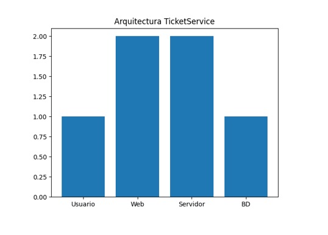
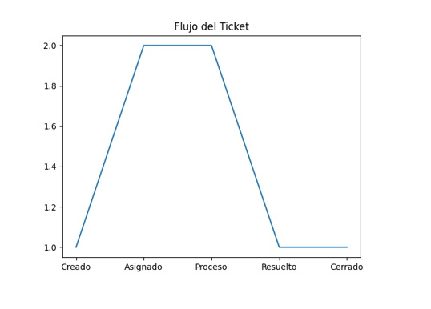

<div align="center">

# UNIVERSIDAD ESPÍRITU SANTO  
**Ciencias de la Computación**  
**Ingeniería de Software I**

<br>

## GRUPO 5  
Christian Leonardo Suarez Rios  
Jose Moises Arias Zavala  

<br>

# DISEÑO DE ARQUITECTURA DE SOFTWARE  
## TicketService  
### Versión 1.1.0  

<br>

Febrero, 2026  
Guayaquil, Ecuador  

</div>

---

# 🕘 Historial de Versionamiento

| Fecha | Versión | Descripción | Responsable |
|--------|----------|-------------|-------------|
| 19/01/26 | 1.0.0 | Creación del documento TicketService | Equipo de Desarrollo |
| 28/02/26 | 1.1.0 | Documento completo con trazabilidad y formato IEEE | Equipo de desarrollo |

---

# 📑 Contenido

1. Historial de Versionamiento  
2. Listado de tablas  
3. Listado de gráficos  
4. Introducción  
5. Mapeo del Hardware y Software  
   - 5.1 Diagrama de Infraestructura  
   - 5.2 Diagrama de Arquitectura (Macro)  
   - 5.3 Diagrama de Componentes (Micro)  
   - 5.4 Diagrama de Entidad-Relación  
6. Control de Acceso y Seguridad  
7. Referencias  

---

# Listado de tablas


---

## Listado de gráficos




---


# I. INTRODUCCIÓN

TicketService es un sistema web diseñado para la creación, gestión y seguimiento de tickets de soporte técnico y órdenes de trabajo en organizaciones educativas y pequeñas empresas.

El sistema centraliza solicitudes, asigna técnicos responsables, controla prioridades, gestiona SLA y genera reportes de desempeño.

Desde el punto de vista arquitectónico, se implementa bajo una arquitectura cliente-servidor en tres capas, garantizando:

- Separación de responsabilidades  
- Escalabilidad  
- Mantenibilidad  
- Seguridad  

---

# II. DESCRIPCIÓN GENERAL DEL SISTEMA

## A. Propósito

Definir la arquitectura de software del sistema TicketService, incluyendo infraestructura, componentes, modelo de datos y mecanismos de seguridad.

## B. Alcance

El sistema permitirá:

1. Gestión de usuarios y roles.
2. Creación, actualización y cierre de tickets.
3. Clasificación por prioridad y categoría.
4. Asignación de tickets a técnicos.
5. Generación de reportes.
6. Control de SLA.

---

# III. MAPEO DE HARDWARE Y SOFTWARE

## A. Hardware

### Cliente
- Computadora o laptop
- Navegador moderno
- Conexión a Internet

### Servidor
- Procesador mínimo 2 núcleos
- 8GB RAM recomendados
- SSD
- Linux o Windows Server

### Base de Datos
- Local o nube (AWS, Azure, DigitalOcean)

---

## B. Software

### Cliente
- HTML5
- CSS3
- JavaScript
- Chrome / Edge / Firefox

### Backend
- Node.js / Java / Python
- Express / Spring Boot / Django

### Base de Datos
- MySQL o PostgreSQL

### Servidor Web
- Nginx o Apache

### Versionamiento
- Git (GitHub)

---

# IV. DIAGRAMA DE INFRAESTRUCTURA

El sistema sigue modelo cliente-servidor.

## Diagrama de Infraestructura

```mermaid
[Usuarios]
     |
     v
[Navegador Web]
     |
     v
[Servidor Web / API Backend]
     |
     v
[Base de Datos]
```


La comunicación se realiza mediante HTTPS con SSL/TLS.

---

## Gráfico 1 – Arquitectura


---

# V. ARQUITECTURA DEL SISTEMA (MACRO)

## Arquitectura en 3 Capas

### 1. Capa de Presentación
- Interfaz web
- Formularios
- Dashboard

### 2. Capa de Lógica de Negocio
- Gestión de tickets
- Gestión de usuarios
- Control de roles
- SLA
- Reportes

### 3. Capa de Datos
- Base de datos relacional
- Tablas
- Procedimientos

### Justificación

- Separación de responsabilidades
- Escalabilidad
- Mantenibilidad
- Adecuada para aplicaciones web académicas

---

# VI. DIAGRAMA DE COMPONENTES (MICRO)

## Capa de Lógica

- AuthController
- UserService
- TicketService
- AssignmentService
- CommentService
- ReportService
- SecurityModule (RBAC)

## Capa de Datos

- UserRepository
- TicketRepository
- AssignmentRepository
- CommentRepository
- RoleRepository
- CategoriaRepository
- PrioridadRepository
- EstadoRepository

---

## Gráfico 2 – Flujo del Ticket



---

# VII. MODELO ENTIDAD-RELACIÓN

## Entidades

### Usuario
- id_usuario (PK)
- nombre
- correo
- contraseña
- id_rol (FK)

### Rol
- id_rol (PK)
- nombre_rol

### Ticket
- id_ticket (PK)
- titulo
- descripcion
- fecha_creacion
- fecha_cierre
- id_usuario (FK)
- id_prioridad (FK)
- id_categoria (FK)
- id_estado (FK)

### Comentario
- id_comentario (PK)
- descripcion
- fecha
- id_ticket (FK)
- id_usuario (FK)

### Asignación
- id_asignacion (PK)
- id_ticket (FK)
- id_tecnico (FK)
- fecha_asignacion

Relaciones:

- Rol 1 — N Usuario  
- Usuario 1 — N Ticket  
- Ticket 1 — N Comentario  
- Ticket 1 — N Asignación  
- Ticket N — 1 Prioridad  
- Ticket N — 1 Categoría  
- Ticket N — 1 Estado  

El modelo está normalizado y mantiene integridad referencial.

---

# VIII. CONTROL DE ACCESO Y SEGURIDAD

## Modelo RBAC

### Administrador
- Gestión completa del sistema

### Técnico
- Gestiona tickets asignados

### Usuario
- Crea y consulta tickets

---

## Mecanismos de Seguridad

### Autenticación
- Login con correo y contraseña
- Contraseñas cifradas (hash seguro)

### Autorización
- Validación por rol
- Restricción de rutas

### Seguridad de Comunicación
- HTTPS
- SSL/TLS

### Seguridad de Datos
- Claves foráneas
- Validación contra SQL Injection
- Control de sesiones

### Respaldo
- Copias periódicas
- Restauración ante fallos

---

# IX. TABLA DE TRAZABILIDAD DE REQUISITOS

| ID | Requisito | Tipo | Módulo | Entidad |
|----|-----------|------|--------|---------|
| RF-01 | Crear ticket | Funcional | TicketService | Ticket |
| RF-02 | Editar ticket | Funcional | TicketService | Ticket |
| RF-03 | Cerrar ticket | Funcional | TicketService | Ticket |
| RF-04 | Asignar ticket | Funcional | AssignmentService | Asignación |
| RF-05 | Agregar comentario | Funcional | CommentService | Comentario |
| RF-06 | Gestionar usuarios | Funcional | UserService | Usuario |
| RF-07 | Autenticación | Funcional | AuthController | Usuario |
| RF-08 | Generar reportes | Funcional | ReportService | Ticket |
| RNF-01 | Seguridad HTTPS | No Funcional | Infraestructura | Sistema |
| RNF-02 | Control RBAC | No Funcional | SecurityModule | Rol |
| RNF-03 | Integridad referencial | No Funcional | Base de Datos | Todas |
| RNF-04 | Disponibilidad 99% | No Funcional | Infraestructura | Sistema |

---

# X. CONCLUSIONES

El diseño arquitectónico de TicketService garantiza:

- Separación clara de responsabilidades  
- Modelo escalable  
- Seguridad mediante RBAC  
- Integridad de datos  
- Adaptabilidad a entornos académicos y empresariales  

La arquitectura en tres capas facilita el mantenimiento y evolución futura del sistema.

---

# XI. REFERENCIAS

[1] R. Pressman, *Ingeniería de Software*, McGraw-Hill, 2014.  
[2] I. Sommerville, *Software Engineering*, Pearson, 2016.  
[3] IEEE Computer Society, *SWEBOK*, 2014.