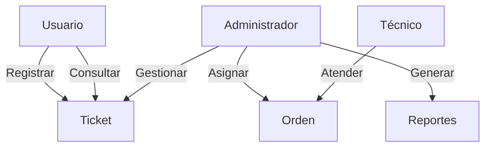
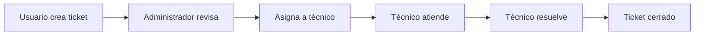
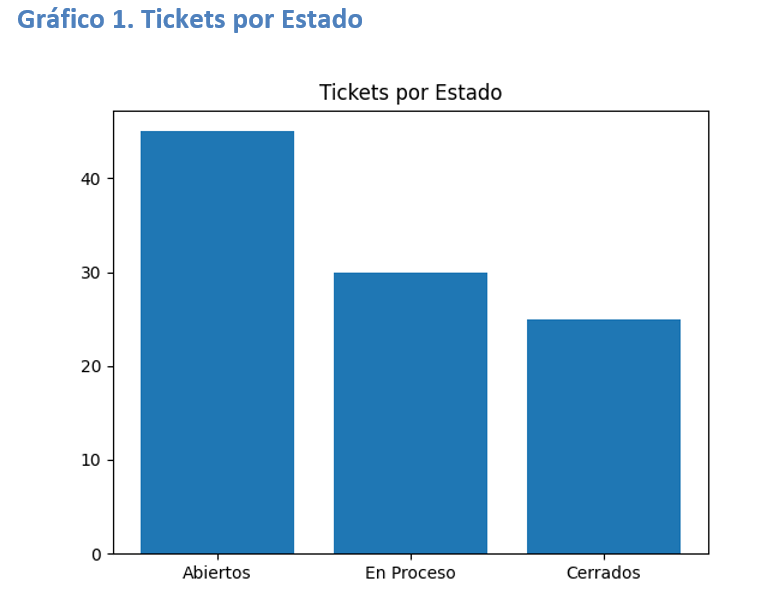

# 📌 TicketService – Actores, Funcionalidades y Diagramas
**Proyecto:** TicketService  
**Versión:** 1.0.0  
**Fecha:** 19 de enero de 2026  
**Carrera:** Ingeniería de Software I

UNIVERSIDAD ESPÍRITU SANTO

Carrera de Computación 
Ingeniería de Software I 

---

## 1. Introducción

TicketService es un sistema de información orientado a la **gestión de tickets de servicio y órdenes de trabajo**, diseñado para optimizar los procesos de atención, soporte técnico y mantenimiento en organizaciones públicas y privadas.

---

## 2. Actores del sistema

### 🧑‍💼 Administrador
Responsable de la configuración, control y supervisión general del sistema.

**Acciones:**
- Iniciar sesión
- Administrar usuarios y roles
- Configurar SLA
- Gestionar tickets y órdenes de trabajo
- Generar reportes y métricas

---

### 🧑‍🔧 Técnico
Encargado de resolver las órdenes de trabajo asignadas.

**Acciones:**
- Iniciar sesión
- Ver órdenes asignadas
- Actualizar estado y avances
- Resolver tickets dentro del SLA

---

### 🧑‍💻 Usuario
Cliente interno que solicita soporte mediante tickets.

**Acciones:**
- Iniciar sesión
- Registrar tickets
- Consultar estado
- Ver historial de solicitudes

---

## 3. Funcionalidades del sistema

| Código | Funcionalidad                    | Actor         | Descripción |
|------|---------------------------------|---------------|-------------|
| F1 | Iniciar sesión | Todos | Acceso según rol |
| F2 | Registrar ticket | Usuario | Crear solicitud de servicio |
| F3 | Consultar ticket | Usuario | Ver estado y progreso |
| F4 | Gestionar tickets | Administrador | Clasificar y priorizar |
| F5 | Asignar órdenes | Administrador | Asignar tickets a técnicos |
| F6 | Gestionar órdenes | Técnico | Actualizar avances |
| F7 | Controlar SLA | Administrador | Medir tiempos de atención |
| F8 | Reportes y métricas | Administrador | Apoyo a decisiones |
| F9 | Gestión de usuarios | Administrador | Roles y permisos |

---

## 4. Diagrama de Casos de Uso

## Gráfico 1. Tickets por Estado

**Descripción:**  
Este gráfico muestra la distribución de los tickets según su estado actual
(Abiertos, En Proceso y Cerrados).