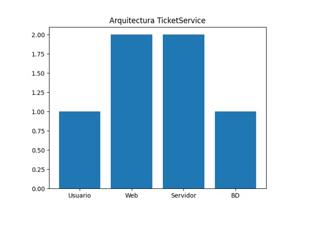
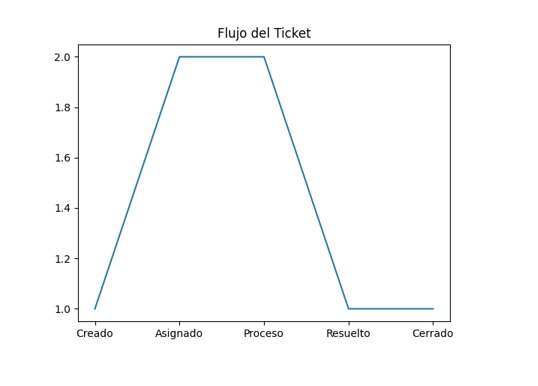

# UNIVERSIDAD ESPÍRITU SANTO

**Ciencias de la Computación** 
**Ingeniería de Software I**

 

## GRUPO 5

Christian Leonardo Suarez Rios 
Jose Moises Arias Zavala

 

### Questions & Answers  
### Caso de Estudio  
**Versión 1.0.0**

  

**19 de enero, 2026**  
Guayaquil, Ecuador

## 🕘 Historial de Versionamiento

| Fecha | Versión                    | Descripción         | Responsable |
|------|---------------------------------|---------------|-------------|
| 19/01/26 | 1.0.0 | Creación del documento TicketService | Equipo de Desarrollo |

---

## 📘 1. Introducción

### 🎯 Propósito
El presente documento describe el sistema TicketService, el cual permitirá la creación, gestión y seguimiento de tickets de soporte técnico de manera centralizada.

### 📌 Alcance
- Gestión de usuarios y roles
- Creación, actualización y cierre de tickets
- Clasificación por prioridad y categoría
- Asignación de tickets
- Reportes de atención

### 📖 Definiciones, Acrónimos y Abreviaciones

**Ticket**: Solicitud registrada en el sistema.
**Usuario**: Persona que crea tickets.
**Agente**: Persona que atiende tickets.
**SLA**: Acuerdo de nivel de servicio.
---

##  🌐 Descripción Global
TicketService se compone de los siguientes módulos:
- Administración
- Gestión de Tickets
- Seguimiento
- Reportes

---

## 📍 Posicionamiento

### 💼 Oportunidad del Negocio

TicketService puede ser comercializado como una solución web para instituciones educativas y pequeñas empresas.

---

## ⚠️ Determinación del Problema

| Problema | Afectados                | Impacto         | Solución |
|------|-----------------------------|---------------|-------------|
| Gestión manual de solicitudes | Usuarios y técnicos | Retrasos y pérdida de información | Implementación de TicketService |

---

## 🧭 Determinación del Problema

| ¿Para quién? | Nombre del producto  | ¿Qué es?|
|------|----------------------|-----------------------------------------------------|
| Organizaciones | TicketService| Sistema de gestión de tickets y órdenes de trabajo  |

---

##  👥 Descripción de los Interesados y Usuarios
###  🤝 Resumen de los Stakeholders

| Cargo | Representa  | Rol                 |
|------|----------------------|---------------------|
| Administrador | Organización| Gestión del sistema |
| Usuario | Clientes internos| Registro de tickets |

---

##  👤  Resumen de los Usuarios

| Nombre | Descripción  |
|------|----------------------|
| Administrador | Configura y controla el sistema|
| Técnico | Resuelve órdenes de trabajo|

---

##  💻  Ambiente del Usuario
El sistema se ejecutará en navegadores web modernos y será compatible con cualquier sistema operativo.

---

## 🗂️ Descripción del Sistema de Información

###  🔍 Perspectivas
TicketService es similar a herramientas como Freshdesk o Zendesk, pero orientado a contextos académicos y empresariales básicos.
### Licenciamiento e Instalación
Licencia GNU GPL v3.0. Instalación local o en la nube.

---

### ⚙️ Características
**Característica 1**: Gestión de Tickets
**Característica 2**: Gestión de Usuarios y Roles
**Característica 3**: Reportes y Seguimiento

---

###  📊  Gráficos

### 🧑‍💻 Referencias Bibliográficas

**Pressman, R. (2014). Ingeniería de Software: Un enfoque práctico. McGraw-Hill.**
**Sommerville, I. (2016). Software Engineering. Pearson Education.**
**IEEE Computer Society. (2014). Guide to the Software Engineering Body of Knowledge (SWEBOK).**